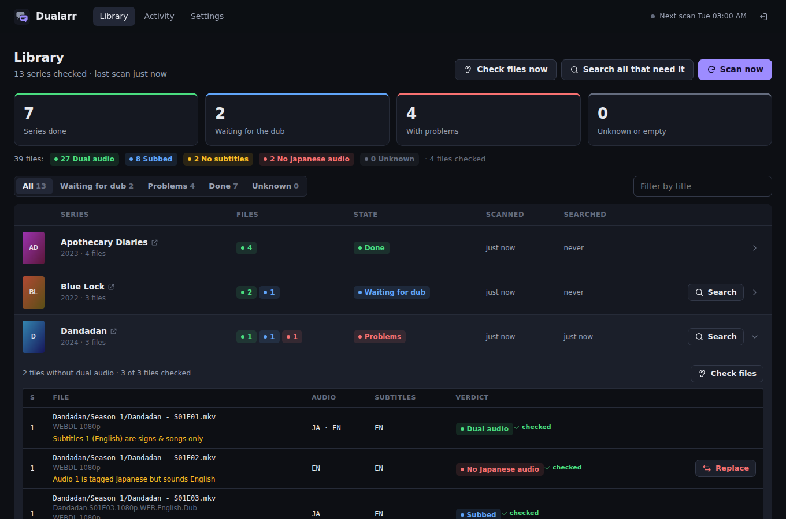
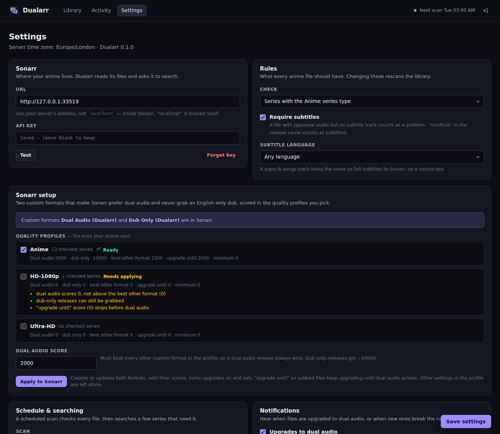
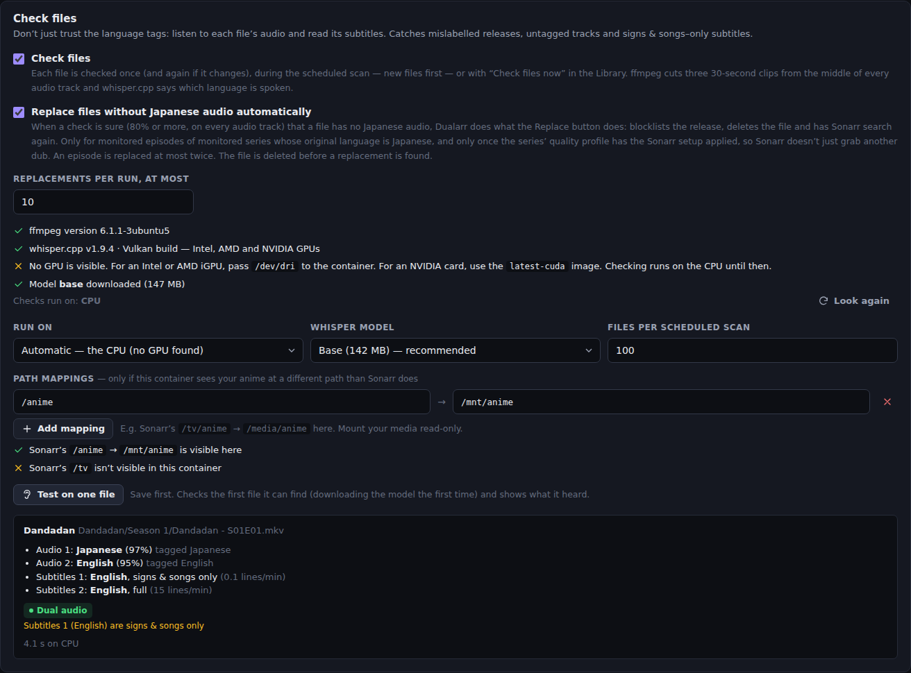
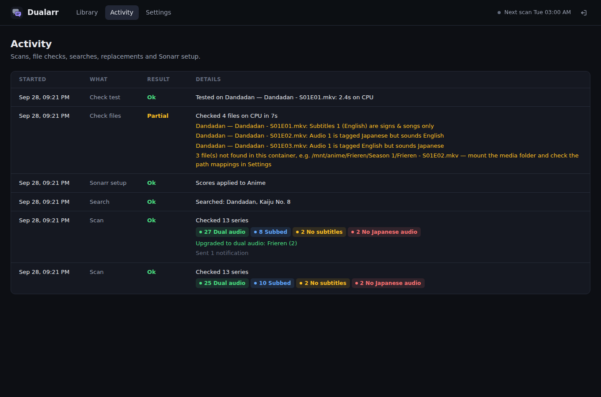

# Dualarr

Keeps the anime in **Sonarr** in Japanese with subtitles, and swaps subbed-only releases for **dual audio** once the dub comes out.



Dualarr is a companion to Sonarr, and a sibling of [Courarr](https://github.com/jpjoseph12/courarr). Courarr decides what gets added to Sonarr. Dualarr checks what is already on disk.

## What it does

1. **Custom formats in Sonarr, in one click.** Dualarr creates two custom formats and scores them in the quality profiles you pick:
   - **Dual Audio (Dualarr)** is scored high (+2000 by default), so a dual audio release is always an upgrade over a subbed one.
   - **Dub Only (Dualarr)** is scored −10000, so English-only dubs are never grabbed.

   It also turns upgrades on and sets the profile's "upgrade until" score, so subbed files keep being upgraded until dual audio arrives. From then on, Sonarr's own RSS sync and upgrade logic replaces subbed files by itself.
2. **A check of every file on disk**, using Sonarr's media info (the languages of the audio and subtitle tracks). Each file gets one verdict:
   - **Dual audio**: Japanese and English audio, with subtitles
   - **Subbed**: Japanese audio and subtitles, waiting for the dub
   - **No subtitles**: Japanese audio but no (matching) subtitle track. "HardSub" in the file or release name counts as subtitled.
   - **No Japanese audio**: for example an English-only dub
   - **Unknown**: Sonarr has no media info, or the tracks aren't tagged with a language

   Japanese is the default original language. Per quality profile you can choose another language, or **original language only** instead of dual audio: see [Dual audio or original language only](#dual-audio-or-original-language-only-in-any-language).
3. **Search and replace.**
   - **Search** asks Sonarr to look for better releases. A season where every file needs work gets one season search, which finds batch releases (where dual audio usually turns up); otherwise the monitored episodes are searched one by one.
   - The **nightly scan** also searches a few series (10 by default), least recently searched first, and waits a week before searching the same series again. A big library is worked through over a few nights without hammering your indexers.
   - **Replace** is for files that break the rules (no audio in the original language, no subtitles, or dual audio in an original-only profile). It marks the release that produced the file as failed in Sonarr (so it is blocklisted), deletes the file and searches for the episode again.
4. **Checking the files themselves (optional).** Language tags can be wrong. With [Check files](#check-files) on, Dualarr listens to each audio track with [whisper.cpp](https://github.com/ggml-org/whisper.cpp) and reads the subtitles, on the CPU or a GPU. That catches mislabelled releases, untagged tracks and signs & songs-only subtitles.
5. **Notifications** (Discord, Telegram, ntfy, Gotify or a JSON webhook) when files are upgraded to dual audio, when new files break the rules, and when a scheduled scan can't reach Sonarr.

## Before you start: turn on "Analyse video files" in Sonarr

Dualarr reads each file's audio and subtitle languages from Sonarr's media info. Sonarr only collects it when **Settings → Media Management → Analyse video files** is on (click **Show Advanced** to see it). It is on by default. If Dualarr shows many **Unknown** files, check this setting, then use **Refresh & Scan** on the series in Sonarr and scan again in Dualarr.

## Install

### Unraid

Once Dualarr is listed in Community Applications: **Apps** → search **Dualarr** → **Install** → **Apply**. Until then:

- **Unraid 7**: open a terminal (the **>_** icon at the top right) and run
  ```bash
  mkdir -p /boot/config/plugins/dockerMan/templates-user && wget -qO /boot/config/plugins/dockerMan/templates-user/my-Dualarr.xml https://raw.githubusercontent.com/jpjoseph12/dualarr/main/templates/dualarr.xml
  ```
  then **Docker** tab → **Add Container** → **Template** → **Dualarr** (under *User templates*) → **Apply**.
- **Unraid 6**: **Docker** tab → **Template repositories** (at the bottom) → add `https://github.com/jpjoseph12/dualarr` → **Save**, then **Add Container** → **Template** → **Dualarr** → **Apply**.

There are two templates. **Dualarr** is for checking files on the CPU or an Intel/AMD iGPU. **Dualarr-NVIDIA** is for servers with an NVIDIA card; on Unraid 7 its command is
```bash
mkdir -p /boot/config/plugins/dockerMan/templates-user && wget -qO /boot/config/plugins/dockerMan/templates-user/my-Dualarr-NVIDIA.xml https://raw.githubusercontent.com/jpjoseph12/dualarr/main/templates/dualarr-nvidia.xml
```
See [Check files](#check-files) for the GPU settings.

The defaults are fine: web UI on port **6162**, settings in `/mnt/user/appdata/dualarr`, running as `99:100`. Unraid sets `TZ` for you. **Media** (your anime folder, read-only) is only needed for Check files.

### Docker Compose

```yaml
services:
  dualarr:
    image: ghcr.io/jpjoseph12/dualarr:latest
    container_name: dualarr
    restart: unless-stopped
    ports:
      - "6162:6162"
    environment:
      - TZ=Europe/London   # scheduled scans run in this time zone
      - PUID=1000
      - PGID=1000
    volumes:
      - ./config:/config
      # - /srv/media/tv:/tv:ro   # for Check files: your anime, read-only
```

`docker compose up -d`, then open `http://<server>:6162`. [`docker-compose.yml`](docker-compose.yml) also has the lines for an iGPU and for NVIDIA.

| Variable | Default | |
|---|---|---|
| `TZ` | `Etc/UTC` | Time zone for the schedule |
| `PUID` / `PGID` | `99` / `100` | User and group the app runs as. `/config` is owned by them. |
| `UMASK` | `002` | File creation mask |
| `PORT` | `6162` | Port inside the container |
| `DUALARR_RESET_AUTH` | | Set to `true` once to remove a forgotten login, then remove it again. Settings are kept. |

## First run

1. Open the web UI and create your login.
2. **Settings → Sonarr**: enter Sonarr's URL (your server's address, not `localhost`) and its API key (Sonarr → Settings → General). Press **Test**, then **Save settings**. Dualarr runs the first scan straight away.
3. **Settings → Sonarr setup**: tick the quality profiles your anime uses (the ones your anime series already use are ticked for you), and press **Apply to Sonarr**. Each profile should then show **Ready**.
4. Back in the **Library**, **Search all that need it** starts the first round of searches. After that the nightly scan takes over.



## Check files

Sonarr only knows what a file's tracks are *labelled*. Some releases get that wrong: an English dub tagged Japanese, a Japanese track with no tag at all, or an "English" subtitle track that only has the signs and song lyrics. With **Settings → Check files** on, Dualarr checks each file itself:

- **Audio.** ffmpeg cuts three 30-second clips from the middle of each audio track, at 30%, 50% and 70% of the episode. The middle matters because dubs keep the Japanese opening and ending songs. whisper.cpp then says which language each clip is. A track's language is the one with the most confidence over its clips; if whisper isn't at least 50% sure, the tag stands.
- **Subtitles.** Each text track (SRT, ASS, …) is read. Its language comes from the text, and its lines per minute in the middle of the episode tell full dialogue (usually 8–20 a minute) from signs & songs (a handful). Picture-based subtitles (Blu-ray PGS, DVD) can't be read, but their events are counted the same way. A track titled "Signs", "Songs" or "Forced" is signs & songs.
- What a check finds replaces the tags in that file's verdict, and anything that disagreed shows under the file in the Library. For example: *Audio 1 is tagged Japanese but sounds English*, or *Subtitles 2 (English) are signs & songs only*.

Each file is checked once, and again only if it changes. The nightly scan checks up to 100 (by default) not-yet-checked files, newest first, before it works out the verdicts. So it notifies you about what it found, and the backlog of an existing library is worked through over a few nights. **Check files now** in the Library does the next batch straight away, and **Check files** on a series checks all of its files again.



### Setting it up

1. **Give Dualarr your anime, read-only.** On Unraid, fill in **Media** in the template. With Compose, add a volume. The easiest setup uses the same container path Sonarr uses (if Sonarr sees `/tv/anime`, mount the same host folder at `/tv` in Dualarr too). Otherwise add a **path mapping** in Settings, such as Sonarr's `/tv/anime` → `/media/anime`. Settings shows whether each of Sonarr's root folders is visible.
2. **Turn on Check files** and pick where it runs (below). **Test on one file** checks the first file it can find and shows what it heard.
3. The first check downloads the whisper model (once) into `/config/models` from [Hugging Face](https://huggingface.co/ggerganov/whisper.cpp). **Base** (142 MB) is a good default; **Tiny** (75 MB) is faster; **Small** (466 MB) is more accurate. Everything else runs locally.

### CPU, iGPU or NVIDIA GPU

whisper.cpp runs on the CPU in every image, and on a GPU when the container can see one. **Settings → Check files** lists the GPUs it found. **Run on** can be *Automatic* (the first GPU, else the CPU), *CPU only*, or a specific GPU.

| Hardware | Image / Unraid template | What to add |
|---|---|---|
| CPU only | `latest` / **Dualarr** | Nothing |
| Intel or AMD integrated GPU (or an AMD card) | `latest` / **Dualarr** | Pass `/dev/dri`. In the Unraid template, set **iGPU (Intel/AMD)** to `/dev/dri`. With Compose, uncomment the `devices:` lines. Runs through Vulkan. |
| NVIDIA GPU (GTX 900 series and newer) | `latest-cuda` / **Dualarr-NVIDIA** | Unraid: install the **Nvidia-Driver** plugin, then the Dualarr-NVIDIA template (it sets `--runtime=nvidia` and `NVIDIA_VISIBLE_DEVICES`). Elsewhere: the NVIDIA Container Toolkit and the `deploy:` lines in the Compose file. Runs through CUDA. |

Notes:

- **GTX 10 series (e.g. a GTX 1050 Ti):** supported. The CUDA image is built with CUDA 12 for this reason, because CUDA 13 dropped these cards. NVIDIA's 580 driver branch is the last to support them, so keep the Nvidia-Driver plugin on a 580 driver (not a newer branch). A 4 GB card runs any of the three models.
- **One NVIDIA card for several containers** (Plex, Jellyfin, Tdarr…) is fine. The checks only use it for a few seconds per file.
- **The `latest` image and NVIDIA:** its Vulkan build can also use an NVIDIA card when `NVIDIA_DRIVER_CAPABILITIES` includes `graphics`, but the CUDA image is the supported way.
- **No GPU?** The CPU works too, just slower. The nightly batch is limited (**Files per scheduled scan**), so only the size of the first backlog really depends on speed.
- The container adds itself to the groups that own `/dev/dri` (`video`/`render`), so it doesn't need to run privileged.

## How the custom formats work

Sonarr gives every release a custom format score, and within the same quality it prefers the release with the higher score. Dualarr's two formats look at the release name:

- **Dual Audio (Dualarr)** matches names like `Dual Audio`, `Dual-Audio`, `Multi-Audio`, `Dual-Lang`, `JPN+ENG` or `JA-EN`.
- **Dub Only (Dualarr)** matches `Dub`, `Dubbed` or `English Dub`, unless the name also says dual audio.

In each profile you pick, **Apply to Sonarr**:

- scores Dual Audio at the dual audio score (2000 by default) and Dub Only at −10000,
- turns **Upgrades Allowed** on,
- raises **Upgrade Until Custom Format Score** to at least the dual audio score, so a subbed file keeps being upgraded until a dual audio release arrives, and then stops,
- raises **Minimum Custom Format Score** if it was negative enough to let a dub-only release through.

Everything else in the profile (qualities, other formats and their scores) is left alone. Applying again updates the formats in place; nothing is duplicated.

## Dual audio or original language only, in any language

Each quality profile in **Settings → Sonarr setup** has two choices, and every series follows the profile it uses in Sonarr:

- **Mode**
  - **Dual audio (original + English)**, the default: subbed files wait for the dub and are upgraded when it comes out.
  - **Original language only**: original audio with subtitles is the goal. In Sonarr, Dual Audio is scored −10000 like Dub Only, so dual audio releases are never grabbed. *Upgrade Until Custom Format Score* comes back down to what your other formats can reach, and *Upgrades Allowed* is left as it is. In Dualarr, a dual audio file is a problem that can be searched for and replaced, and a subbed file is done.
- **Original language**: **Japanese** by default. You can pick another (Chinese, Korean and more) or **Each series' own (from Sonarr)**, which uses the original language Sonarr has for the series. That suits a library with Chinese animation (donghua) next to anime: a donghua needs Chinese audio, and its Japanese dub counts as a dub.

To give some series different rules, make a second quality profile in Sonarr (for example *Anime — Japanese only*) and move those series to it. Changing a profile's mode or language rescans the library.

## Rules

- **Check**: series with the Anime series type (the default), or also any series whose original language is Japanese.
- **Require subtitles**: on by default. Turn it off if you are happy with Japanese audio alone.
- **Subtitle language**: any language by default, or a specific one (English, Spanish, Portuguese, French, German, Italian, Arabic, Russian).

Changing a rule rescans the library, without sending notifications.

## Caveats

- **Quality comes first.** Sonarr ranks quality above custom format score. A dual audio release at a lower quality than your current file (a 720p dual audio release against a 1080p subbed file, say) won't replace it. Allow the qualities you would accept for dual audio in the profile.
- **Custom formats only see release names.** Sonarr can only tell a release is dual audio if its name says so ("Dual Audio", "Multi-Audio", "JPN+ENG" and so on). The language pairs in the pattern are Japanese + English; for other original languages, only the generic "Dual Audio" and "Multi-Audio" names are recognised. The file scan reads the real audio tracks, so it is the ground truth: a dual audio release with a plain name shows up as dual audio once it is on disk, and a mislabelled one shows up as what it really is. The two parts work together.
- **Signs & songs tracks count as subtitles** unless [Check files](#check-files) is on. Media info can't tell a signs & songs track apart from full subtitles, so a file with only signs & songs passes the subtitle check.
- **Checks are good, not perfect.** A clip with only music or silence can be misheard. That is why there are three clips and a confidence threshold, and why an unsure result keeps the tag. Text subtitle languages are recognised for English, Spanish, Portuguese, French, German, Italian, Russian, Arabic, Japanese, Chinese and Korean. Reading subtitles means reading the whole file once, which is the slow part on spinning disks.
- **Very high scores in other formats.** If another custom format in a profile scores more than the dual audio score, a subbed release with it could beat a dual audio one. Raise the dual audio score above it. The setup panel flags this, and also flags a profile where another format scores so high (10000 or more) that a dub-only release could still be grabbed.
- **Unknown files are skipped.** Files without media info are never searched or replaced. See [Analyse video files](#before-you-start-turn-on-analyse-video-files-in-sonarr).

## Activity and API

**Activity** lists every scan, search, replace and setup, with what it found and any warnings.



Scripts can use the API key from **Settings → Login & API key**, in an `X-Api-Key` header or an `?apikey=` parameter:

```sh
curl -X POST -H "X-Api-Key: <key>" http://<server>:6162/api/scan       # scan now (runs in the background)
curl -X POST -H "X-Api-Key: <key>" http://<server>:6162/api/search     # search every monitored series that needs it
curl -H "X-Api-Key: <key>" http://<server>:6162/api/library            # every series with its counts and state
curl -H "X-Api-Key: <key>" http://<server>:6162/api/status             # the job in progress, next scan, last run
```

## Development

Node 24 (22.13+ works), no build step.

```sh
npm install
npm run dev             # http://localhost:6162, settings in ./.config
npm test                # unit, API and browser tests against a local stand-in Sonarr (install ffmpeg to run the file-check tests)
npx playwright install chromium   # once, for the browser tests in test/ui.test.js (or set CHROMIUM_PATH)
npm run test:coverage   # the same, with the coverage thresholds CI enforces
node test/fixtures/mock-sonarr.mjs   # a stand-in Sonarr on :8989 (API key "sonarrkey") to click around with
npm run icon            # redraw public/icon.png after changing the logo
```

## License

MIT
